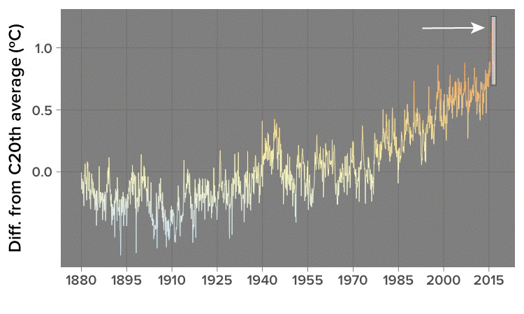

# 2016 Will Be The Warmest Year, But This Is How Deniers Will Spin It

```{r knitr_options, include=FALSE}
library(knitr)
opts_chunk$set(out.width="625px", dpi=300)
```

[R](https://www.r-project.org/) code for the analysis supporting [this December 20, 2016 BuzzFeed News article](https://www.buzzfeed.com/peteraldhous/another-hottest-year) on the likelihood that 2016 will be the warmest year on record, and how that is being spun by deniers of climate science. Supporting files are in [this GitHub repository](https://github.com/BuzzFeedNews/2016-12-warmest-year).

## Data preparation
The following code loads [data on the average global temperature ](https://www.ncdc.noaa.gov/cag/time-series/global/globe/land_ocean/p12/12/1880-2016) from the National Oceanic and Atmospheric Adminstration for each month since January 1880, recorded as the difference from the global average for the 20th century.

It creates the columns `Year`, `Date` (to plot the entire temperature timeline),  `Date_2016` (with the monthly data for each year transposed to 2016, allowing all the data to be readily plotted on one yearly plot), and `Weight` (to allow the data for 2016 to be distinguished in the initial animation). 

```{r, results="hide", warning=FALSE, message=FALSE}
# load required packages
library(dplyr)
library(readr)

# load and process global temp data
global_temp <- read_csv("https://www.ncdc.noaa.gov/cag/time-series/global/globe/land_ocean/all/12/1880-2016.csv", skip = 3) %>%
  rename(Yr_Mo = Year) %>%
  mutate(Year = as.integer(substr(Yr_Mo,1,4)),
         Date = as.Date(paste0(substr(Yr_Mo,1,4),
                       "-",
                       substr(Yr_Mo,5,6),
                       "-01")),
         Date_2016 = as.Date(paste0("2016-",
                               substr(Yr_Mo,5,6),
                               "-01")),
         Weight = ifelse(Year==2016,2,1))
```

## Charts

To create animations from this code, you will need to install [ImageMagick](http://imagemagick.org/script/index.php).

### Animation of average global temperature by year

```{r, results="hide", warning=FALSE, message=FALSE}
# load required packages
library(ggplot2)
library(gganimate)

# set palette and values for breaks
pal <- c("#313695","#4575b4","#74add1","#abd9e9","#e0f3f8","#ffffbf","#fee090","#fdae61","#f46d43","#d73027","#a50026")
values <- seq(-2, 2, length = 11)

# global temperature animation
temp_anim <- ggplot(global_temp, aes(x=Date_2016, y=Value, color = Value, group = Year, frame = Year, cumulative = TRUE)) +
  geom_path(aes(size=Weight, alpha=Weight)) + 
  scale_size_continuous(range = c(0.5, 1), guide = FALSE) +
  scale_alpha_continuous(range = c(0.5, 1), guide = FALSE) +
  theme_dark(base_size = 20, base_family = "Proxima Nova Semibold") +
  scale_color_gradientn(colors = pal, values=values, rescaler = function(x, ...) x, oob = identity, guide = FALSE) +
  ylab("Diff. from C20th average (ºC)") +
  xlab("") +
  scale_x_date(date_labels = "%b",
               date_breaks = "month") +
  theme(panel.grid.minor = element_blank())

# save as GIF
gg_animate(temp_anim, "temp_anim.gif", ani.width = 625, ani.height = 350,  interval = 0.05)

# increase delay on final frame
system("convert temp_anim.gif \\( +clone -set delay 300 \\) +swap +delete  temp_anim_with_pause.gif")
```


### Full global average temperature timeline

```{r, warning=FALSE, message=FALSE}
# full global temperature timeline
full_series <- ggplot(global_temp, aes(x=Date, y=Value, color = Value)) +
  geom_path(size = 0.3) + 
  theme_dark(base_size = 19, base_family = "Proxima Nova Semibold") +
  scale_color_gradientn(colors = pal, values=values, rescaler = function(x, ...) x, oob = identity, guide = FALSE) +
  ylab("Diff. from C20th average (ºC)") +
  xlab("") +
  # geom_smooth(se = FALSE, color="white", size=0.5) +
  scale_x_date(date_labels = "%Y",
               breaks = seq(as.Date("1880-01-01"), as.Date("2015-01-01"), by="15 years"))  +
  theme(panel.grid.minor = element_blank())

plot(full_series)
```

### Partial timeline, from March 2016 only

```{r, warning=FALSE, message=FALSE}
# global temperature timeline from Mar 2016 only
part_series <- ggplot(slice(global_temp, 1635:1643), aes(x=Date, y=Value, color = Value)) +
  geom_line(size = 0.5) + 
  theme_dark(base_size = 19, base_family = "Proxima Nova Semibold") +
  scale_color_gradientn(colors = pal, values=values, rescaler = function(x, ...) x, oob = identity, guide = FALSE) +
  ylab("Diff. from C20th average (ºC)") +
  xlab("") +
  scale_x_date(date_labels = "%b %Y") +
  theme(panel.grid.minor = element_blank())

plot(part_series)
```

### Second animation, showing how climate denialists are spinning the data

After annotation in [Adobe Illustrator](http://www.adobe.com/products/illustrator.html) and saving the two timelines in a folder called `denial_frames`, this code creates the second animation in the post. (Here, the code to create the first timeline omitted the grid line and tick mark at -0.5ºC, to keep the size of the plot panels consistent.)

```{r, warning=FALSE, message=FALSE}
# create GIF with fade transition between full and partial timelines
system("convert -delay 20 denial_frames/*.jpg -morph 8 denial.gif")

# increase delay on first frame
system("convert denial.gif \\( +clone -set delay 300 \\) +swap +delete  denial_with_pause.gif")

# increase delay on final frame
system("convert denial_with_pause.gif \\( -clone 0  -set delay 300 \\) -swap 0,-1 +delete denial_with_pause.gif")
```


